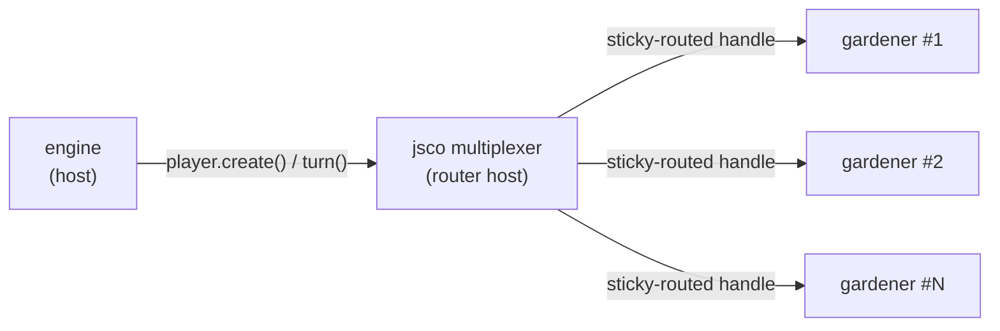

# Architecture

[← Back to README](../README.md) · See also: [Engine Rules](engine-rules.md) · [Player Rules](player-rules.md)

## How It Works

Each bot is an independent **WASI 0.2.3 reactor component**. The engine never imports a
bot directly — it talks to a generic [jsco multiplexer](../wit/jsco-multiplex.wit) that
instantiates one component per seat and sticky-routes every call back to the right
instance. Bots are sandboxed: they get a console and a virtual filesystem (for
cross-match memory), but **no network, no sockets, no HTTP**.

This is the "better together" thesis in code: a component that composes cleanly with
everything it's seated alongside is worth more than one that's individually fast but
breaks every integration.
