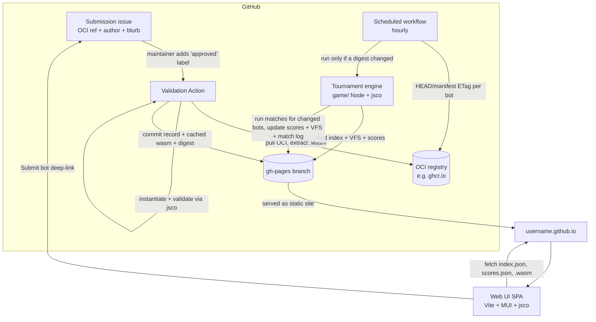
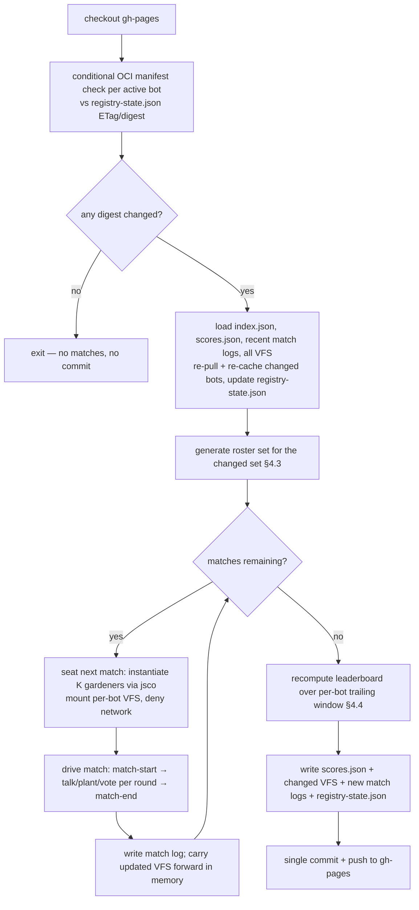
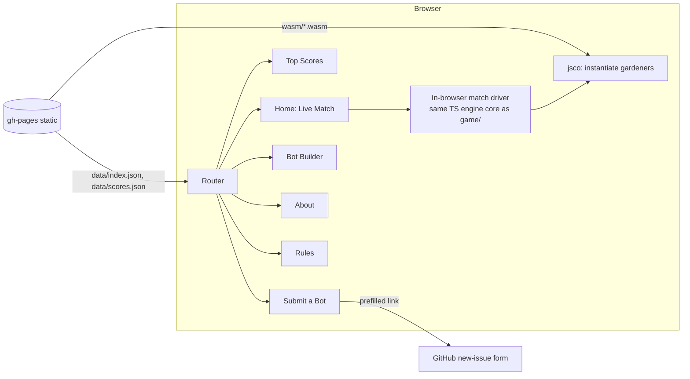

# Architecture

[← Back to README](../README.md) · See also: [Engine Rules](engine-rules.md) · [Player Rules](player-rules.md) · [UI Sketches](UI-sketches.md) · [Implementation Plan](implementation-plan.md)

This document describes the **system architecture** of the Better Together
tournament: how bots are registered, how matches are run, where data lives, and
how the web UI consumes it. It is the contract between the four moving parts:

1. **Registry & data store** — JSON + cached binaries on the `gh-pages` branch.
2. **Validation Action** — GitHub Action that validates a submitted bot.
3. **Tournament engine** — a TypeScript/Node orchestrator that runs matches on a
   schedule (`game/`).
4. **Web UI** — a serverless Vite + MUI + jsco SPA (`web/`) served from
   `github.io`.

All four are **serverless**: there is no always-on backend. State is a set of
files on the `gh-pages` branch; compute happens inside GitHub Actions
(scheduled and issue-triggered) and inside the visitor's browser.

---

## 1. System overview



**Key principle — the `gh-pages` branch is the single source of truth.** It is
both the database (read/written by Actions) and the published website (read by
the browser). Every artifact the browser needs is therefore same-origin: no
CORS, no proxy, no runtime OCI pulls from the browser.

---

## 2. Data store (the `gh-pages` branch)

Everything is committed to `gh-pages` and served verbatim from `github.io`.

```
gh-pages/
├── index.html                 # the SPA entry (built from web/)
├── assets/                    # SPA JS/CSS bundles (Vite output)
├── data/
│   ├── index.json             # registry of all validated bots
│   ├── scores.json            # current leaderboard (Best Co-Player + Raw)
│   ├── registry-state.json    # per-bot OCI ETag/digest cache (change detection)
│   └── meta.json              # tournament metadata (engine version, counters)
├── wasm/
│   └── <bot-id>/<version>.wasm # cached component bytes (same-origin for UI)
├── icons/
│   └── <bot-id>.png           # validated avatar, resized to 100×100 (same-origin)
├── vfs/
│   └── <bot-id>/...           # each bot's persisted cross-match memory (≤ 256 KB)
└── matches/
    └── YYYY/MM/DD/<runId>/
        └── <matchId>.json     # append-only match log (seeded, replayable)
```

> **`<bot-id>` is the manufactured in-game id** (see §2.1), e.g.
> `1a2b3c4d#together.ferris`. The `#` is path-safe and keeps every bot's
> artifacts grouped under one stable, URL-derived key.

### 2.1 `data/index.json` — the bot registry

Written by the **Validation Action**, read by the **engine** and **UI**.

```jsonc
{
  "version": 1,
  "updated": "2026-06-10T12:00:00Z",
  "bots": [
    {
      "id": "1a2b3c4d#together.ferris", // manufactured: fnv1a32(oci) # namespace.Name
      "name": "together.ferris",         // metadata.name (namespace.name)
      "namespace": "together",
      "shortName": "ferris",             // the segment after the dot
      "version": "1.0.0",
      "author": "Jane Doe",
      "repo": "https://github.com/jane/ferris",
      "lore": "Reputation-aware, naively collaborative.",
      "glyph": "🦀",
      "icon": "icons/1a2b3c4d#together.ferris.png", // cached 100×100, or null
      "iconSource": "https://.../ferris.png",       // original metadata.icon URL, or null
      "oci": "ghcr.io/jane/ferris:1.0.0",// provenance — where it came from; hashed for the id
      "ociDigest": "sha256:9f86d08…", // current manifest digest (change detection)
      "ociEtag": "\"33a64df5…\"",      // last manifest ETag, or null
      "wasm": "wasm/1a2b3c4d#together.ferris/1.0.0.wasm", // same-origin cached copy
      "wasmSha256": "…",
      "submittedBy": "jane",             // GitHub login from the issue
      "approvedBy": "maintainer-login",  // who applied the 'approved' label
      "issue": 123,                       // submission issue number
      "validatedAt": "2026-06-10T11:58:00Z",
      "lastDigestChangeAt": "2026-06-10T11:58:00Z", // when the wasm last changed under this ref
      "matchesSinceUpdate": 0,            // matches logged since the last digest change
      "status": "active"                  // active | inactive | retired | rejected
    }
  ]
}
```

#### The manufactured in-game id

The `id` is **not** the bot's `metadata.name`; it is derived during registration
so identity is pinned to the exact image the bot was admitted from:

```
id = fnv1a32_hex(oci_ref) + "#" + metadata.name
   = "1a2b3c4d" + "#" + "together.ferris"
```

- `fnv1a32_hex` is the 32-bit FNV-1a hash of the OCI ref string, lower-case
  zero-padded hex (8 chars).
- Hashing the URL means a re-publish to a *different* ref is a *different* bot
  (its own scores and VFS), while the human-readable `namespace.Name` suffix keeps
  the id legible in logs, file paths, and the UI.
- A re-publish to the **same** ref (a new wasm digest under an unchanged tag)
  keeps the **same id, score history, and VFS** — new results simply blend into
  the rolling window, so old behaviour ages out naturally over the next window's
  worth of matches (see [§4.4](#44-scoring)). `lastDigestChangeAt` /
  `matchesSinceUpdate` record the cutover so the UI can show "updated N matches ago".
- This `id` is the key used everywhere downstream: `wasm/`, `icons/`, `vfs/`,
  `matches/*.json`, and `scores.json`.

### 2.2 `data/scores.json` — the leaderboard

Written by the **engine** after each scheduled run, read by the **UI**.

```jsonc
{
  "version": 1,
  "computedAt": "2026-06-10T12:00:00Z",
  "window": { "matchesPerBot": 500 },    // per-bot trailing window (matches, not time)
  "minMatchesToRank": 50,                 // bots below this are listed but unranked
  "baselineMeanGroupTotal": 64.2,         // mean group_total over the window
  "leaderboard": [
    {
      "id": "5d6e7f80#together.bram",   // manufactured in-game id (see §2.1)
      "rank": 1,                          // null while unranked (matchesInWindow < 50)
      "ranked": true,                     // false until the bot has ≥ 50 matches
      "coPlayerScore": 3.10,              // primary crown (Approx. Shapley)
      "coPlayerStdErr": 0.28,            // shrinks ~ 1/sqrt(matches)
      "rawScore": 18.2,                  // secondary, "selfish" board
      "consistencyStd": 4.9,             // tiebreaker (lower is better)
      "matchesInWindow": 240
    }
  ]
}
```

The formulas are exactly those in
[Engine Rules §7–§9](engine-rules.md#7-the-best-co-player-score).

### 2.3 `matches/.../<matchId>.json` — the match log

Every match is logged with the RNG **seed** so it can be replayed
deterministically (the UI surfaces and can replay it).

```jsonc
{
  "matchId": "2026-06-10T12:00:00Z-0007",
  "seed": "a1b2c3d4e5f6…",              // hex; reproduces the entire match
  "engineVersion": "0.1.0",
  "triggeredBy": "5d6e7f80#together.bram", // the changed bot whose update scheduled this match
  "groupSize": 4,
  "players": ["5d6e7f80#together.bram", "9a0b1c2d#together.corro", "3e4f5061#together.khaos", "7283940a#together.andy"],
  "playerDigests": {                     // wasm digest each seat played (so scores can be attributed to a version)
    "5d6e7f80#together.bram": "sha256:9f86…"
  },
  "roundsPlayed": 11,
  "rounds": [
    {
      "round": 1,
      "signals":  [{ "id": "5d6e7f80#together.bram", "signal": "bloom" }, …],
      "plants":   [{ "id": "5d6e7f80#together.bram", "plant": 8, "signal": "bloom" }, …],
      "votes":    [{ "voter": "5d6e7f80#together.bram", "target": "9a0b1c2d#together.corro" }, …],
      "gardenTotal": 21, "taxTarget": "9a0b1c2d#together.corro", "taxCollected": 4,
      "gardenPayout": 12.5,
      "roundScores":   [14.5, 18.5, 16.5, 15.5],
      "runningTotals": [14.5, 18.5, 16.5, 15.5]
    }
  ],
  "scores": [{ "id": "5d6e7f80#together.bram", "matchScore": 162.0 }, …],
  "groupTotal": 680.0
}
```

### 2.4 `data/registry-state.json` — OCI change-detection cache

Written and read by the **scheduled workflow** so an hourly tick does no work
unless a bot's image actually changed. For each active bot it records the last
seen OCI manifest **digest** and **ETag**:

```jsonc
{
  "version": 1,
  "checkedAt": "2026-06-10T12:00:00Z",
  "bots": {
    "5d6e7f80#together.bram": {
      "oci": "ghcr.io/jane/bram:latest",
      "digest": "sha256:9f86d08…",       // last manifest digest seen
      "etag": "\"33a64df5…\""             // last manifest ETag (conditional GET)
    }
  }
}
```

Each tick issues a cheap conditional manifest request per active bot
(`If-None-Match: <etag>`); a `304 Not Modified` (or an unchanged digest) means
*no change*. A bot whose digest changed is added to the run's **changed set**
(see [§4.1](#41-engine-run-lifecycle-one-scheduled-invocation)); if the changed
set is empty the workflow exits without running any matches.

### 2.5 `vfs/<bot-id>/` — cross-match memory

Each bot's private virtual filesystem (its only persistence channel; ≤ 256 KB,
see [Engine Rules §6](engine-rules.md#6-identity--memory)). The engine loads it
into an in-memory `Map` before a match, lets jsco mount it as the bot's
`wasi:filesystem` preopen, then writes any changes back at the end of the run.
If a bot's written VFS exceeds **256 KB**, the engine **erases** that bot's VFS
(persists an empty filesystem) rather than truncating it — a bot that overruns
its memory budget starts fresh next match.

---

## 3. Registration & validation flow

```mermaid
sequenceDiagram
    actor Dev as Contributor
    actor Main as Maintainer
    participant GH as GitHub Issues
    participant Act as Validation Action
    participant OCI as OCI registry
    participant GP as gh-pages

    Dev->>GH: Open "Submit a gardener" issue (template)<br/>fields: OCI ref, author handle, short description
    Main->>GH: Review &amp; add label: approved
    GH->>Act: labeled('approved') event
    Act->>Act: Parse issue form → { oci, author, blurb }
    Act->>OCI: Pull OCI artifact (oras / wkg) + record digest/ETag
    OCI-->>Act: wasm component bytes
    Act->>Act: Validate (see §3.1) via jsco in Node
    alt valid
        Act->>Act: Manufacture id = fnv1a32(oci) # namespace.Name
        Act->>Act: Fetch + validate + resize avatar → 100×100 PNG
        Act->>GP: commit wasm/<id>/<ver>.wasm + icons/<id>.png + update index.json + registry-state.json (digest/ETag)
        Act->>GH: comment ✅ "admitted as <id>"
        Act->>GH: label: accepted
    else invalid
        Act->>GH: comment ❌ with the specific failure
        Act->>GH: label: rejected
    end
```

Submissions are **gated by a maintainer**: anyone may open a "Submit a gardener"
issue (OCI ref, author handle, short description), but validation only runs once
a maintainer applies the **`approved`** label. This keeps obvious spam and abuse
out of CI while leaving the heavy lifting — pulling, instantiating, and
sandbox-validating the image — fully automated. The Action only ever *reads* the
OCI image and *runs it inside the jsco sandbox*; a malicious image cannot escape
(no network, no host FS — see §6). On admission it seeds `registry-state.json`
with the image's digest/ETag so the scheduler can later detect updates.

### 3.1 Validation checks

The Action performs, in order, failing fast with a specific message:

| # | Check | Rule |
|---|-------|------|
| 1 | OCI pullable | The ref resolves and yields a single wasm component artifact |
| 2 | Size limit | The extracted `.wasm` is **≤ 15 MB**; a larger component is **friendly-rejected** with a clear message asking the author to trim it |
| 3 | Component shape | Exports `better-together:gardener/player@0.1.0` (verified via jsco instantiation) |
| 4 | `metadata()` returns ok | `create()` then `gardener.metadata()` succeed within budget |
| 5 | `name` = `namespace.name` | Exactly one `.`; `namespace` matches `^[a-z][a-z0-9-]*$`; name segment non-empty ([Engine Rules → Validation](engine-rules.md#validation)) |
| 6 | `glyph` is a single UTF character | One grapheme |
| 7 | `icon` shape | `none`, or a syntactically valid `https:` URL that resolves to a fetchable image |
| 8 | Avatar fetch, validate & resize | If `icon` is set: fetch (size-capped), confirm it decodes as a real image (PNG/JPEG/WebP/GIF), strip metadata, **resize to 100×100 PNG**, and cache to `icons/<id>.png`. A broken/oversized/non-image URL fails validation; the bot may still be admitted iconless if the author resubmits without it |
| 9 | Manufacture in-game id | `id = fnv1a32_hex(oci) + "#" + metadata.name` (see [§2.1](#21-dataindexjson--the-bot-registry)) |
| 10 | Identity unique | The manufactured `id` (hence the OCI ref) is not already registered; a different ref for the same `name` is a distinct bot, an identical ref is a duplicate submission |
| 11 | Capability denial | Instantiated with the gardener whitelist only; absence of `wasi:sockets`/`wasi:http` confirmed (the `attacker` sample is the negative fixture) |
| 12 | Smoke-test match | A full smoke match (4 seats, a few rounds) completes without sandbox violation, persistent traps, exceeding the memory quota, or breaching the 50 ms/call budget. The smoke match runs on a scratch VFS that is **thrown away** — nothing it writes is persisted to `vfs/` |


These reuse the exact harness contract already proven in
[tests/lib/harness.mjs](../tests/lib/harness.mjs) (`instantiateWasiComponent`,
`enabledInterfaces` whitelist, in-memory `fs`, captured stdio).

---

## 4. Tournament engine (`game/`)

A TypeScript project run by Node inside a **scheduled (hourly) GitHub Action**.
It is the *host/orchestrator* described in [game.wit](../wit/game.wit): it seats
players, drives the match loop, resolves rounds per
[Engine Rules §3–§5](engine-rules.md#3-round-resolution-executed-by-engine), and
aggregates the leaderboards.

> **Where the engine logic lives.** The round-resolution rules are implemented
> directly in TypeScript (mirroring the `runner`/`match` semantics of
> [game.wit](../wit/game.wit)), so the whole tournament is debuggable in plain
> Node. jsco is used **only** to instantiate and call the *gardener* (player)
> components. Packaging the engine itself as the `engine` component remains a
> future option — the TS implementation is the reference.

### 4.1 Engine run lifecycle (one scheduled invocation)



The hourly tick is **change-gated**: it first does a cheap conditional manifest
check for every active bot against `registry-state.json` and, if **nothing
changed**, exits immediately without running matches or committing. Only when one
or more bots have a new digest does it run — and then it runs **~500 matches**
(a tunable constant) seating the **changed bot(s)**, never re-litigating the
whole pool.

A single run is the **sole writer**, so there are no concurrent-write races.
The workflow uses a `concurrency` group to guarantee runs never overlap; if a
run is still going when the next hour fires, the new one is queued/cancelled.

### 4.2 Seating & sandboxing (jsco)

For each seat the engine calls `instantiateWasiComponent(bytes, config)` with:

- `fs`: a `Map` seeded from `vfs/<bot-id>/` (and carried forward across the run).
- `stdout`: captured per-seat → folded into banter for the match log. (`stderr`
  is captured for diagnostics but is **not** shown as banter in the UI.)
- `enabledInterfaces`: the gardener whitelist (`wasi:cli`, `wasi:io`,
  `wasi:filesystem`, `wasi:clocks`, `wasi:random`, `better-together:gardener`) —
  **no `wasi:sockets`, no `wasi:http`**.
- `limits`: memory ceiling (16 MB) and a VFS byte quota (≤ 256 KB; overflow
  erases the bot's VFS, see [§2.5](#25-vfsbot-id--cross-match-memory)).
- `random`: a **seeded** PRNG derived from the match seed (§4.5).

Every player call is wrapped so a **trap or timeout fails only that one call**:
the engine substitutes the documented default (`WATCH` for `talk`, `0` for
`plant`, abstain for `vote`) and continues — exactly as `roster.seat` promises
in [game.wit](../wit/game.wit).

**The engine validates every response.** A returned value is checked for shape
and range before it is used: `talk` must be one of `bloom`/`hold`/`watch`;
`plant` must be an integer `0–10` (out-of-range is clamped); `vote` must be a
`player-id` present in this match or abstain. A malformed or out-of-contract
response is treated like a trapped call — the default is substituted.

#### Enforcement → `inactive`

Violations that are the bot's fault are not merely defaulted-over; they **mark
the bot `inactive`** so it is dropped from future rosters until resubmitted:

- **Sandbox violation** — any attempt to use a denied capability
  (`wasi:sockets`/`wasi:http`) or otherwise escape the jsco sandbox →
  `status: inactive`.
- **Timing violation** — any `talk`/`plant`/`vote` call exceeding **50 ms** of
  wall-clock time → `status: inactive`. (The call also defaults for the round in
  progress.)

An `inactive` bot keeps its history and scores but is not seated again; the
author must fix and resubmit (a new OCI ref → a new id) to re-enter the pool.

> **Timing note.** The 50 ms / call budget is enforced as a wall-clock watchdog
> in Node (to catch runaway loops), not a precise mid-execution cutoff — JS
> cannot preempt wasm deterministically. The watchdog rejects the call, the
> default is substituted for the round, and the bot is marked `inactive`.

### 4.3 Roster generation — seating the changed bots

A run only happens because one or more bots changed (§4.1), so roster generation
is built around that **changed set**. The objective: give each changed bot enough
fresh matches to (re)estimate its Co-Player score, while spending opponent slots
where they do the most good.

For the run's match budget `B` (~500 matches, tunable), each match:

1. Draws `K ∈ {4,5,6}` **uniformly at random**.
2. **Seats a changed bot** in one seat (round-robin across the changed set so each
   gets a fair share of `B`).
3. Fills the remaining `K−1` seats from the active pool **weighted toward bots
   with the fewest matches in their window** — newer/under-sampled bots are more
   likely to be drawn, which tightens *their* estimates as a side-effect and
   avoids starving fresh entrants of games.

> **Statistical note.** Pure Shapley attribution wants *uniformly* random
> coalitions ([Engine Rules §7](engine-rules.md#7-the-best-co-player-score)).
> Because opponent draws here are weighted (not uniform), the Co-Player numerator
> for a bot is computed against the **same windowed field mean** used for every
> bot, and `coPlayerStdErr` is reported so the leaderboard can show confidence.
> The weighting changes *which* matches get played, not how a played match is
> scored; over the rolling window every active bot still accumulates a broad,
> well-mixed set of opponents.

Diversity guard: a short memory of recent group compositions avoids re-running
identical groups back-to-back, improving coverage per match.

### 4.4 Scoring

Recomputed after each run over a **per-bot trailing window of the last 500
matches** that bot played (a tunable constant), exactly as in
[Engine Rules §7–§9](engine-rules.md#7-the-best-co-player-score):

- `coPlayerScore(i) = mean(group_total over i's windowed matches) − mean(group_total over all windowed matches)`
- `rawScore(i) = mean(match_score(i) over i's windowed matches)`
- `consistencyStd(i) = stddev(group_total over i's windowed matches)`
- Ranking: Co-Player → Consistency → Raw (tiebreakers).
- **Ranking eligibility:** a bot is **listed but unranked** until it has
  **≥ 50 matches** in its window (`ranked: false`, `rank: null`), so a handful of
  lucky/unlucky tables can't crown a barely-played bot.
- The rolling window means an **updated** bot's pre-update matches age out over
  its next ~500 games: history is kept and new results simply blend in (no hard
  reset), and `matchesSinceUpdate` lets the UI flag a recent change.
- `coPlayerStdErr` is reported so the UI can show confidence and the roster
  weighting (§4.3) knows which bots are still under-sampled.

### 4.5 Determinism & replay

Each match gets a **seed** (derived from a run-level master seed + match index).
The seed feeds: the geometric stop (hidden round count R), seat order, and each
gardener's `wasi:random`. The seed is stored in the match log and is sufficient
to **replay the entire match** byte-for-byte — given the same component bytes.
The UI displays the seed and can re-run a logged match from it (§5).

---

## 5. Web UI (`web/`)

A **serverless SPA** (Vite + React + MUI + jsco), built into the `gh-pages`
site. It is **exhibition only** — nothing it does affects the official
leaderboard. See [UI Sketches](UI-sketches.md) for wireframes.



- **Shared engine core.** The match-driver/round-resolution logic is factored
  into a framework-agnostic core package consumed by *both* `game/` (Node) and
  `web/` (browser), so a UI match resolves identically to a CI match.
- **Home — Live Match.** Picks (or lets you configure) a roster from
  `index.json`, fetches each bot's same-origin `.wasm`, runs a **seeded** match
  live in the browser, and animates: a **garden** of `glyph`s as seeds are
  planted, a **votes/tax** panel, a **running score** panel, and a **banter
  console** (captured **stdout** only). The seed is shown and editable for replay.
- **Top Scores.** Renders `scores.json` (Co-Player primary, Raw secondary,
  confidence bars from `coPlayerStdErr`). Each row links to that bot's detail page.
- **Bot Detail.** A page per bot (`/bot/:id`, keyed by the manufactured in-game
  id) showing the full `index.json` record — cached 100×100 **avatar**, glyph,
  `namespace.Name`, version, author, repo, OCI provenance, lore, and its current
  leaderboard standing — plus a `Watch in a match` deep-link to Home.
- **Submit a Bot.** A form that builds a **prefilled GitHub issue link**
  (template + query params: OCI ref, etc.) — no API calls, no auth.
- **Bot Builder.** A JS editor whose script is loaded by a **prebuilt JS-host
  gardener component** (the `khaos`/`reynard` pattern): the user's strategy is
  injected via the host gardener's VFS/env, then played in a local match against
  chosen opponents. No in-browser componentization required.
- **About / Rules.** Static pages linking jsco, WASI, and the Better Together
  repos, and rendering the rules docs.

---

## 6. Security & sandboxing

- **Untrusted code runs only inside jsco** with the gardener capability
  whitelist. Network interfaces (`wasi:sockets`, `wasi:http`) are *not* enabled,
  so a bot cannot reach the network from CI or the browser. The `attacker`
  sample is the standing negative fixture proving denial
  ([tests/attacker.test.mjs](../tests/attacker.test.mjs)).
- **Maintainer-gated intake.** Validation (and any OCI pull) runs only after a
  maintainer applies the `approved` label, so an attacker can't trigger CI work
  or cache arbitrary images merely by opening an issue.
- **OCI pulls are read-only.** The Validation Action only downloads and inspects
  the artifact; it never executes the image as a container — it extracts the
  wasm and runs it in jsco. Update checks use cheap conditional manifest
  requests (ETag) and re-pull only when the digest changes.
- **Resource limits.** 16 MB memory ceiling, 15 MB max component size at
  submission, ≤ 256 KB VFS (overflow erases the bot's VFS), and a 50 ms/call
  wall-clock watchdog; traps/timeouts degrade to defaults for the round.
- **Enforcement.** The engine **validates every response** (shape + range) and
  marks a bot `inactive` on a sandbox violation or a >50 ms call, dropping it
  from future rosters until the author resubmits (see
  [§4.2](#42-seating--sandboxing-jsco)).
- **Per-seat VFS isolation.** Each gardener sees only its own
  `vfs/<bot-id>/` mounted as a private preopen — no cross-bot reads.
- **Single-writer state.** Only the scheduled engine writes scores/VFS/logs, and
  only the Validation Action writes the index/wasm cache; the workflow
  `concurrency` group prevents overlap.
- **Supply-chain provenance.** The OCI ref is retained in `index.json` and the
  cached wasm is pinned by `wasmSha256`, so the served bytes are auditable
  against the source image.
- **Avatar sanitization.** Author-supplied `icon` URLs are fetched **only in CI**
  (never by the visitor's browser), size-capped, decoded, stripped of metadata,
  and **re-encoded as a 100×100 PNG** served same-origin from `icons/`. The UI
  never loads the original third-party URL, so it cannot leak visitor IPs or
  serve a malicious payload, and a dead source URL can't break the site.

---

## 7. Repository layout (additions)

```
better-together/
├── game/          # tournament engine + orchestrator (TS / Node)  ← this design
│   ├── src/
│   │   ├── core/      # shared match driver + scoring (used by web/ too)
│   │   ├── host/      # jsco seating, VFS mount, sandbox config
│   │   ├── roster/    # roster-set generation (§4.3)
│   │   ├── scan/      # OCI manifest ETag/digest change detection (§2.4)
│   │   ├── store/     # gh-pages read/write (index, registry-state, icons, scores, vfs, logs)
│   │   ├── validate/  # OCI pull, id (fnv1a32) + avatar resize, checks, admit
│   │   └── run.ts     # scheduled entry point
│   └── package.json
├── web/           # SPA (Vite + MUI + jsco)                        ← this design
│   ├── src/{pages,components,engine,data}/  # pages incl. /bot/:id detail
│   └── package.json
├── .github/
│   ├── ISSUE_TEMPLATE/submit-gardener.yml   # form: OCI ref, author handle, short description
│   └── workflows/
│       ├── validate-bot.yml                 # on: issues (labeled 'approved')
│       ├── tournament.yml                   # on: schedule (hourly) — runs only if a digest changed
│       └── deploy-site.yml                  # build web/ → gh-pages
└── …
```

---

## 8. Open questions / future work

- **Engine as a component.** Compile the TS engine core to the `engine` world in
  [game.wit](../wit/game.wit) for a fully WASM-composed tournament.
- **Published jsco.** The engine and UI consume a local jsco checkout today;
  switch to the published `@pavelsavara/jsco` when it ships.
- **Retirement policy.** When/how bots move to `status: retired` (e.g. OCI ref
  no longer resolvable, or author request).
- **Constant tuning.** The 500-matches-per-run budget, the per-bot 500-match
  window, the ≥ 50-match ranking threshold, and the opponent under-sampling
  weight are all starting values to tune against observed convergence.
- **Update cutover.** With "keep history, blend in" on a same-ref re-publish, an
  updated bot mixes old and new behaviour until pre-update matches age out of the
  window. `playerDigests` / `matchesSinceUpdate` are recorded so a stricter
  cutover (e.g. weighting post-update matches, or a "since update" sub-board)
  remains possible later without a data migration.
