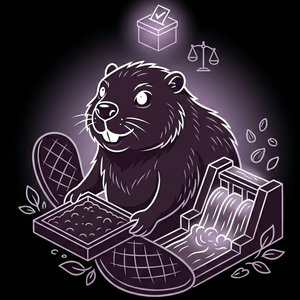

# 🦫 Bram — the guild boss



> Bram doesn't play for his own pot. He plays for his *table*. He knows his
> members by name, rallies them every round, keeps the dam full, and when a
> free-rider sits down to skim the common stream, he aims his ballot to tax them.
> He never votes against a member. He *aspires* to a table that does better
> together — though whether the room actually rewards an organizer is for the
> tournament, not Bram, to decide.

Bram is the **coalition organizer** of the [Better Together](../../README.md)
game — the bot built to *probe* whether the **Best-Co-Player crown** rewards
organizing. Every other sample plays its *own* hand; Bram plays the *room*. He is
this game's wager that the winning skill might be organizing cooperation and
disciplining free-riders rather than maximizing your private pot — a hypothesis
the tournament, not the lore, gets to settle.

## The lore

Beavers build communal dams; Bram builds communal gardens. His playbook:

- **Fill the garden, lead from the front.** He signals `BLOOM` honestly and
  plants generously every round — the table's anchor contributor.
- **Run the guild.** Bram recognizes his members by player-id and coordinates the
  bloc: he keeps the table's payout high enough that his members keep cooperating,
  and he steers their behaviour where he can (see *The guild*, below).
- **Direct the tax.** When the vote opens, Bram casts his ballot at a seated
  non-member, non-ally free-rider — a free-rider he has *taxed before* first, and
  otherwise the **fattest hoarder** (the one keeping the most seeds, above the
  untaxable minimum). The tax pulls that stash into the garden, where it's doubled
  and shared, so disciplining a free-rider can make the whole table richer.
- **Never crosses a member.** Bram never aims his own ballot at a guild member or
  at an arbiter ally ([Keith](../keith/README.md), [Andy](../andy/README.md)). He
  can't *shield* a member from anyone else's vote — that is the engine's call —
  but his own loyalty is unconditional.

## The guild

Bram's power is that two of the game's simplest bots are, in effect, his
members — steerable by a boss who understands them:

- **[Nib](../nib/README.md) — the unwitting member.** Nib plants
  `(number of BLOOM signals this round) + 4`. Bram doesn't need Nib's *consent*
  — every `BLOOM` the guild broadcasts mechanically *pumps* Nib's plant. Nib
  is too simple to know it's in a guild; it just follows the promises, and Bram
  manufactures them.
- **[Gopher](../gopher/README.md) — the loyal reflex.** Gopher is win-stay,
  lose-shift: he repeats whatever paid off last round. Bram keeps the guild's
  payout above Gopher's aspiration, so Gopher stays generous out of pure habit.
  The boss farms the forager's reflex.

## Relationships

- **[Khaos](../khaos/README.md)'s sworn foe.** The dice god has Bram on his
  permanent **FOE** list — the dice god despises organized guilds on principle.
  Khaos keeps everything against any table Bram sits at, which makes Bram's job harder and
  their rivalry one of the tournament's running feuds.
- **Nemesis of the free-riders.** [Corro](../corro/README.md) and
  [Reynard](../reynard/README.md) are exactly who Bram's tax exists to punish —
  the blatant feaster and the polite skimmer. Catching the *skimmer* (who stays
  above the floor on purpose) is the harder, more interesting hunt.
- **Natural ally of the arbiters.** [Keith](../keith/README.md) and
  [Andy](../andy/README.md) share Bram's politics; a table with two of them is a
  voting bloc that can tax even a careful free-rider.

## The technology

| | |
|---|---|
| Language | C# |
| Bindings | [`componentize-dotnet`](https://github.com/bytecodealliance/componentize-dotnet) (same toolchain as [Andy](../andy/README.md)) |
| Target | a Component Model component exporting `better-together:gardener/player@0.1.0` |
| Persistence | `wasi:filesystem` — a roster of known members and the free-riders he's taxed before |

## Where to look

- [`src/Strategy.cs`](src/Strategy.cs) holds the boss logic: member recognition,
  the generous anchor, the vote that taxes the table's fattest hoarder (sparing
  members and arbiter allies), and the persisted roster.
- [`src/BramImpl.cs`](src/BramImpl.cs) is the thin export glue that maps the
  generated Component Model records onto the plain strategy types.
- [`src/Banter.cs`](src/Banter.cs) is the guild-boss flavor text on stdout.
- For the role this bot fills — and why the crown rewards it — see the design
  discussion in the top-level [README](../../README.md).

## Build

```sh
dotnet build -c Release
# -> bin/Release/net10.0/wasi-wasm/native/bram.wasm
```
